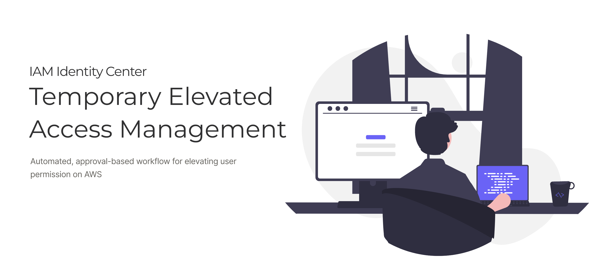

# Temporary elevated access management (TEAM) for AWS IAM Identity Center
This repository contains the source code for deploying TEAM application.

TEAM is an open source solution that integrates with AWS IAM Identity Center and allows you to manage and monitor, time-bound elevated access to your multi-account AWS environment at scale.

The solution is a custom application that allows users to **request access to an AWS account** only when it is needed and only **for a specific period of time**. Once the time period has elapsed, elevated access is automatically removed.

Refer to the [blog post on the AWS Security Blog](https://aws.amazon.com/blogs/security/temporary-elevated-access-management-with-iam-identity-center/) for a background and an overview of the TEAM solution.

## Getting Started
Visit our **[Documentation pages](https://aws-samples.github.io/iam-identity-center-team/)** to learn more and get started installing and using TEAM.

### Quick links
- [Discord](https://discord.gg/bcUxUQMM)
- [Deploying the TEAM application](https://aws-samples.github.io/iam-identity-center-team/docs/deployment/)
- [Solution architecture and workflows](https://aws-samples.github.io/iam-identity-center-team/docs/overview/)
- [User guides and walkthrough](https://aws-samples.github.io/iam-identity-center-team/docs/guides/)
- [Blog Post](https://aws.amazon.com/blogs/security/temporary-elevated-access-management-with-iam-identity-center/)
- [ReInforce Talk](https://www.youtube.com/watch?v=a1Na2G7TTQ0)
- [Feedback Form](https://forms.gle/PDis3i46XABCpSBHA)

## Security

See [CONTRIBUTING](CONTRIBUTING.md#security-issue-notifications) for more information.

## License

This library is licensed under the MIT-0 License. See the LICENSE file.