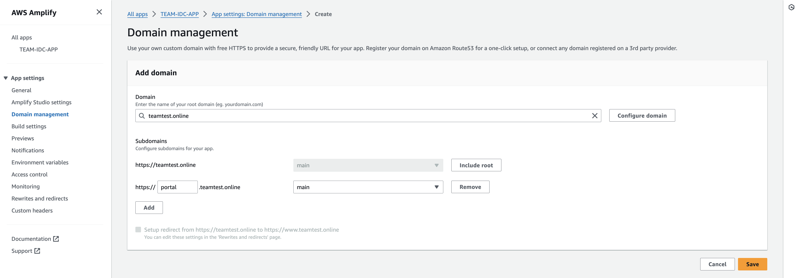

# Custom domain setup

> This step is optional and required only if you intend to use a custom domain for your TEAM deployment instead of the default amplify generated domain name.

TEAM v1.1.1 introduced the use of custom domain instead of the default amplify generated domain name.
To use a custom domain, ensure to update the **parameters.sh** in the **deployment** folder with **UI_DOMAIN** key and your custom domain name before running the **./update.sh** script.

Follow the steps below to integrate your custom domain with amplify once the update deployment is complete.

### Custom domain integration (If Using Custom Domain)

Go to Amplify console: AWS AMPLIFY → All Apps → TEAM-IDC-APP → Domain Management → Add domain.

Follow instructions in Amplify documentation for more details on [setting up custom domains](https://docs.aws.amazon.com/amplify/latest/userguide/custom-domains.html)

Execute the **integration.sh** script and update the applicationstartURL in AWS IAM Identity Center for your TEAM application

Execute the **cognito.sh** script 

> Ensure your custom domain is reflected in  Allowed Callback URLs and Allowed sign-out URLs 
Amazon Cognito → User pools → $(User Pool Name) → App Integration → $(ClientWeb) → HostedUI
