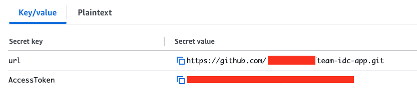

# Prerequisites & setup

## Prerequisites

### AWS Organizations
- [AWS Organizations](https://aws.amazon.com/organizations/) managed multi account environment with [AWS IAM Identity Center](https://aws.amazon.com/iam/identity-center/) federated account access

  > TEAM cannot be used to perform the following tasks:
    - Grant temporary access to the management account
    - Manage permission sets provisioned in the management account

  Read the [security considerations]() section for more information.
  {: .note}

### Permission set
- Configure [Permission sets](https://docs.aws.amazon.com/singlesignon/latest/userguide/permissionsetsconcept.html) in IAM Identity center.    
  > You can either use a predefined permission set provided by Identity Center, or you can create your own permission sets using custom permissions in order to provide least-privilege access for particular operational tasks.
   {: .note}

### Dedicated TEAM account
- Dedicated AWS account for deploying TEAM Application. This account will also be configured as delegated admin for:
  - IAM Identity Center
  - CloudTrail Lake
  - Account management

  [As per AWS best practice](https://docs.aws.amazon.com/organizations/latest/userguide/orgs_best-practices_mgmt-acct.html#best-practices_mgmt-use), it is not recommended to deploy resources in the organization management account. Designate a dedicated account for deploying the TEAM solution. We recommend that you do not deploy any other workloads in this account, and carefully manage users with access to this account based on a need-to-do principle.
  {: .note}

### Cloudtrail Lake organization event datastore
TEAM uses AWS CloudTrail Lake for querying, auditing and logging API activities and actions performed by a user during the period of elevated access.
Create a Cloudtrail Lake organization event datastore in the dedicated TEAM account that stores all log events for all AWS account in your organization

## AWS Secrets Manager
TEAM allows you to use external repositories for deploying the solution. 
Create a secret in AWS Secret Manager containting your repository url and Access token in Secrets manager as shown below 

### TEAM groups
- Create groups within AWS IAM Identity center for **TEAM admins** and **TEAM auditors**. These groups can be created locally (In Identity center) or synchronised from an external identity provider following your organisation's group membership review and attestation process.

  Refer to the [solution overview]() for more information on TEAM personas and groups
  {: .note}

## Development environment setup
- Setup [awscli](https://docs.aws.amazon.com/cli/latest/userguide/getting-started-install.html) and install [git-remote-codecommit](https://docs.aws.amazon.com/codecommit/latest/userguide/setting-up-git-remote-codecommit.html) on your local workstation

- Install [jq](https://github.com/stedolan/jq/wiki/Installation) on your local workstation

- Setup a [named profile](https://docs.aws.amazon.com/cli/latest/userguide/cli-configure-profiles.html) for AWS CLI with sufficient permissions for the **Organization management account**

- Setup a named profile for AWS CLI with sufficient permissions for the **AWS account where the TEAM Application will be deployed in**

  You can use AWS CloudShell instead of the first two steps of setting up awscli, git-remote-codecommit, and jq on a local workstation.
  {: .note}

### 🚀 You can now [Deploy the Application]().
